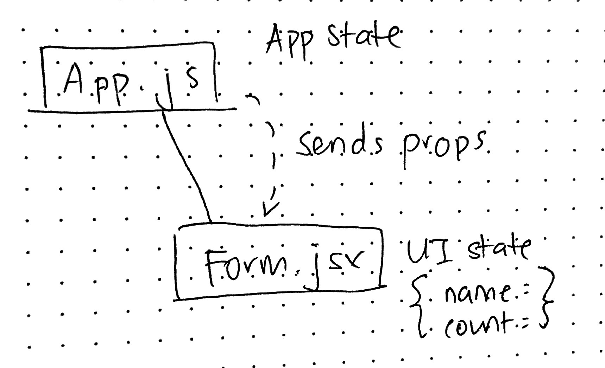

# LAB - 28 B

## Internal State Practice

### Author: Joanna Arroyo

### Links and Resources
* [submission PR](https://github.com/joanna-401-advanced-javascript/lab-28-internal-state/pull/1)
* [travis](https://travis-ci.com/joanna-401-advanced-javascript/lab-28-internal-state)

#### Documentation
* [styleguide](http://localhost:6060/)

### Modules
#### `index.js`, `app.js`, `Form.js`, `setupTests.js`
##### Exported Values and Methods

###### `app.js -> React App component`
###### `Form.js -> React Form component`
###### `index.js -> Renders React to DOM`

### Setup
#### Running the app
* `npm start`
  
#### Tests
* Unit tests: `npm run test`
* Lint tests: `npm run lint`

#### UML
